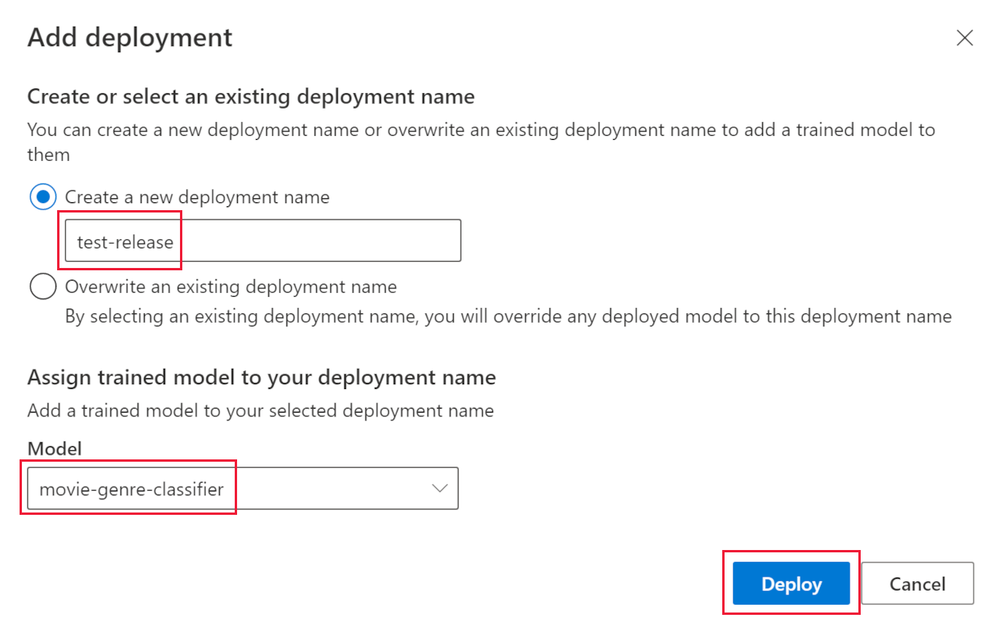
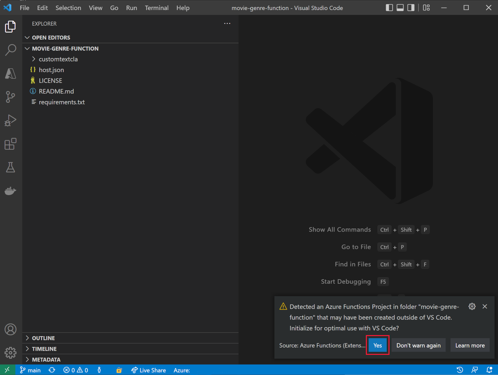

---
lab:
  title: Anreichern eines KI-Suche-Indexes mit benutzerdefinierten Klassen
---

# Anreichern eines KI-Suche-Indexes mit benutzerdefinierten Klassen

Sie haben eine Suchlösung erstellt und möchten Ihren Indizes nun Azure KI Services für Sprachanreicherungen hinzufügen.

In dieser Übung erstellen Sie eine Azure KI-Suche-Lösung und reichern einen Index mit den Ergebnissen eines benutzerdefinierten Textklassifizierungsprojekts aus Language Studio an. Sie erstellen eine Funktions-App, um die Suche und das Klassifizierungsmodell zu verknüpfen.

> **Hinweis** Um diese Übung abschließen zu können, benötigen Sie ein Microsoft Azure-Abonnement. Wenn Sie noch kein Abonnement besitzen, können Sie sich unter [https://azure.com/free](https://azure.com/free?azure-portal=true) für eine kostenlose Testversion registrieren.

## Einrichten Ihrer Entwicklungsumgebung mit Python, VS Code und VS Code-Erweiterungen

Installieren Sie die folgenden Tools, um diese Übung abzuschließen. Sie können die Schritte aber auch ohne diese Tools nachvollziehen.

1. Installieren Sie [Visual Studio Code](https://code.visualstudio.com/).
1. Installieren Sie das [Azure Functions Core-Tool](https://github.com/Azure/azure-functions-core-tools).
1. Installieren Sie die [Azure Tools-Erweiterungen für VS Code](https://code.visualstudio.com/docs/azure/extensions).
1. Installieren Sie [Python 3.8](https://www.python.org/downloads/release/python-380/) für Ihr Betriebssystem.
1. Installieren Sie die [Python-Erweiterung für VS Code](https://marketplace.visualstudio.com/items?itemName=ms-python.python).

## Einrichten Ihrer Azure-Ressourcen

Um Zeit zu sparen, wählen Sie diese Azure ARM-Vorlage aus, um Ressourcen zu erstellen, die Sie später in der Übung benötigen.

### Bereitstellen einer vordefinierten ARM-Vorlage

1. [](https://portal.azure.com/#create/Microsoft.Template/uri/https%3A%2F%2Fraw.githubusercontent.com%2FMicrosoftLearning%2Fmslearn-knowledge-mining%2Fmain%2FLabfiles%2F04-enrich-custom-classes%2Fazuredeploy.json) Wählen Sie diesen Link aus, um Ihre Startressourcen zu erstellen. Möglicherweise müssen Sie den [direkten Link](https://portal.azure.com/#create/Microsoft.Template/uri/https%3A%2F%2Fraw.githubusercontent.com%2FMicrosoftLearning%2Fmslearn-knowledge-mining%2Fmain%2FLabfiles%2F04-enrich-custom-classes%2Fazuredeploy.json) kopieren und in die Suchleiste einfügen.

    
1. Klicken Sie unter **Ressourcengruppe** auf **Neu erstellen**, und nennen Sie die Ressourcengruppe **cog-search-language-exe**.
1. Wählen Sie unter **Region** eine [unterstützte Region](https://learn.microsoft.com/azure/ai-services/language-service/concepts/regional-support) aus, die sich in Ihrer Nähe befindet.
1. Das **Ressourcenpräfix** muss global eindeutig sein. Geben Sie ein Präfix aus zufälligen Nummern und Kleinbuchstaben ein (z. B. **acs18245**).
1. Wählen Sie unter **Standort** dieselbe Region aus wie zuvor.
1. Klicken Sie auf **Überprüfen + erstellen**.
1. Klicken Sie auf **Erstellen**.

    > **Hinweis**: Der Fehler **Sie müssen den unten angegebenen Nutzungsbedingungen zustimmen, um diese Ressource erfolgreich erstellen zu können** wird angezeigt. Durch Klicken auf **Erstellen** stimmen Sie diesen Nutzungsbedingungen zu.

1. Klicken Sie auf **Zu Ressourcengruppe wechseln**, um alle erstellten Ressourcen anzuzeigen.

    
Sie richten einen Azure Cognitive Search-Index ein und erstellen eine Azure-Funktion sowie ein Language Studio-Projekt, um Filmgenres auf Grundlage von Filmzusammenfassungen zu identifizieren.

### Hochladen von Beispieldaten zum Trainieren von Sprachdiensten

In dieser Übung werden 210 Textdateien verwendet, die eine Zusammenfassung der Handlung eines Films enthalten. Der Name der Textdateien entspricht dem Filmtitel. Der Ordner enthält auch die Datei **movieLabels.json**, die der Datei die Genres eines Films zuordnet. Für jede Datei gibt es einen JSON-Eintrag wie den folgenden:

```json
{
    "location": "And_Justice_for_All.txt",
    "language": "en-us",
    "classifiers": [
        {
            "classifierName": "Mystery"
        },
        {
            "classifierName": "Drama"
        },
        {
            "classifierName": "Thriller"
        },
        {
            "classifierName": "Comedy"
        }
    ]
},
```

1. Navigieren Sie zu **Labfiles/04-enrich-custom-classes** und extrahieren Sie den Ordner **movies summary.zip** mit allen Dateien.

    > **Hinweis** Sie verwenden diese Dateien, um ein Modell in Language Studio zu trainieren, und auch alle Dateien in Azure KI-Suche zu indizieren.

1. Wählen Sie im [Azure-Portal](https://portal.azure.com/) die Option **Ressourcengruppen** und dann Ihre Ressourcengruppe aus.
1. Wählen Sie das von Ihnen erstellte Speicherkonto aus, z. B. **acs18245str**.
1. Wählen Sie **Konfiguration** im linken Bereich, dann die Option **Aktivieren** für die Einstellung *Anonymen Blob-Zugriff zulassen* und danach **Speichern** oben auf der Seite aus.

    

1. Klicken Sie links auf **Container** und dann auf **+ Container**.
1. Geben Sie im Bereich **Neuer Container** unter **Name****language-studio-training-data** ein.
1. Wählen Sie unter **Anonyme Zugriffsebene** die Option **Container (Anonymer Lesezugriff für Container und Blobs)** und dann **Erstellen** aus.
1. Wählen Sie den neuen Container **language-studio-training-data** aus, den Sie soeben erstellt haben.
    
1. Klicken Sie oben im Bereich auf **Hochladen**.
1. Wählen Sie im Bereich **Blob hochladen** die Option **Nach Dateien durchsuchen** aus.
1. Navigieren Sie zu der Stelle, an der Sie die Beispieldateien extrahiert haben, markieren Sie den gesamten Text (`.txt`) und die JSON-Dateien (`.json`).
1. Klicken Sie in diesem Bereich auf **Hochladen**.
1. Schließen Sie den Bereich **Blob hochladen**.

### Erstellen einer Sprachressource

1. Klicken Sie im Breadcrumb-Link oben auf der Seite auf **Startseite**.
1. Wählen Sie **+ Ressource erstellen** aus, und suchen Sie nach *Sprachdienst*.
1. Wählen Sie die Option **Erstellen** unter **Sprachdienst** aus.
1. Wählen Sie die Option aus, die **Benutzerdefinierte Textklassifizierung und Erkennung benutzerdefinierter benannter Entitäten** enthält.
1. Klicken Sie auf **Continue to create your resource** (Mit Erstellung Ihrer Ressource fortfahren).
1. Wählen Sie unter **Ressourcengruppe** die Option **cog-search-language-exe** aus.
1. Wählen Sie unter **Region** die zuvor verwendete Region aus.
1. Geben Sie unter **Name****learn-language-service-for-custom-text** ein. Dies muss global eindeutig sein, daher müssen Sie möglicherweise am Ende eine zufällige Zahl- oder Zeichenfolge hinzufügen.
1. Wählen Sie **S** als **Tarif** aus.
1. Wählen Sie unter **Neues/Vorhandenes Speicherkonto** die Option **Vorhandenes Speicherkonto** aus.
1. Wählen Sie unter **Speicherkonto im aktuell ausgewählten Abonnement und in der aktuell ausgewählten Ressourcenregion** das erstellte Speicherkonto aus (z. B. **acs18245str**).
1. Stimmen Sie zu, dass Sie die **Hinweise zu verantwortungsvoller KI** gelesen haben, und klicken Sie dann auf **Überprüfen und erstellen**.
1. Klicken Sie auf **Erstellen**.
1. Warten Sie, bis die Ressourcen bereitgestellt wurden, und klicken Sie dann auf **Zu Ressourcengruppe wechseln**.
1. Wählen Sie **learn-language-service-for-custom-text** aus.

    
1. Scrollen Sie im Bereich **Übersicht** nach unten, und klicken Sie auf **Erste Schritte mit Language Studio**.
1. Melden Sie sich beim Language Studio an. Wenn Sie aufgefordert werden, eine Sprachressource auszuwählen, wählen Sie die Ressource aus, die Sie zuvor erstellt haben.

### Erstellen eines benutzerdefinierten Textklassifizierungsprojekts in Language Studio

1. Klicken Sie auf der Startseite von Language Studio auf **Neu erstellen** und dann auf **Benutzerdefinierte Textklassifizierung**.

    

1. Wählen Sie **Weiter** aus.

    
1. Wählen Sie **Klassifizierung mit mehreren Bezeichnungen** aus, und klicken Sie dann auf **Weiter**.

    

1. Geben Sie unter **Name****movie-genre-classifier** ein.
1. Wählen Sie für **Text primary language** (Primäre Textsprache) die Option **Englisch (USA)** aus.
1. Wählen Sie die Option **Ja, mehrsprachiges Dataset aktivieren** aus.
1. Geben Sie unter **Beschreibung****A model that can identify a movie genre from the summary** (Modell, das ein Filmgenre anhand der Zusammenfassung identifizieren kann) ein.
1. Wählen Sie **Weiter** aus.

    

1. Wählen Sie unter **Blobspeichercontainer** die Option **language-studio-training-data** aus.
1. Wählen Sie **Ja, meine Dokumente sind bereits mit Bezeichnungen versehen, und ich habe eine ordnungsgemäß formatierte JSON-Bezeichnungsdatei** aus.
1. Wählen Sie unter **Bezeichnungsdokumente** die Option **movieLabels** aus.
1. Wählen Sie **Weiter** aus.
1. Wählen Sie **Projekt erstellen** aus.

### Trainieren Ihres KI-Modells für die benutzerdefinierte Textklassifizierung

1. Klicken Sie links auf **Trainingsaufträge**.

    

1. Klicken Sie auf **Trainingsauftrag starten**.

    
1. Geben Sie unter **Neues Modell trainieren****movie-genre-classifier** ein.
1. Wählen Sie **Trainieren** aus.
1. Das Training des Klassifizierungsmodells sollte weniger als zehn Minuten dauern. Warten Sie, bis der Status in **Das Training war erfolgreich** geändert wird.

### Bereitstellen Ihres KI-Modells für die benutzerdefinierte Textklassifizierung

1. Klicken Sie links auf **Deploying a model** (Modell bereitstellen).

    
1. Klicken Sie auf **Bereitstellung hinzufügen**.

    
1. Geben Sie unter **Neuen Bereitstellungsnamen erstellen****test-release** ein.
1. Wählen Sie unter **Modell** die Option **movie-genre-classifier** aus.
1. Klicken Sie auf **Bereitstellen**.

Lassen Sie diese Webseite für einen späteren Schritt im Rahmen dieser Übung geöffnet.

### Erstellen eines Azure KI-Suchindex

Erstellen Sie einen Suchindex, den Sie mit diesem Modell erweitern können. Sie indizieren alle Textdateien, die die bereits heruntergeladenen Filmzusammenfassungen enthalten.

1. Klicken Sie im [Azure-Portal](https://portal.azure.com/) auf **Ressourcengruppen**, wählen Sie dann Ihre Ressourcengruppe und anschließend das erstellte Speicherkonto aus (z. B. **acs18245str**).
1. Klicken Sie links auf **Container** und dann auf **+ Container**.
1. Geben Sie im Bereich **Neuer Container** unter **Name****search-data** ein.
1. Wählen Sie unter **Anonyme Zugriffsebene** die Option **Container** aus.
1. Klicken Sie auf **Erstellen**.
1. Wählen Sie den neuen Container **search-data** aus, den Sie soeben erstellt haben.
1. Klicken Sie oben im Bereich auf **Hochladen**.
1. Wählen Sie im Bereich **Blob hochladen** die Option **Nach Dateien durchsuchen** aus.
1. Navigieren Sie zum Speicherort der Beispieldateien, und wählen Sie **nur** die Textdateien (`.txt`) aus.
1. Klicken Sie in diesem Bereich auf **Hochladen**.
1. Schließen Sie den Bereich **Blob hochladen**.

### Importieren von Dokumenten in Azure KI-Suche

1. Wählen Sie **Ressourcengruppen** auf der linken Seite aus, wählen Sie Ihre Ressourcengruppe und dann Ihren Suchdienst aus.

1. Klicken Sie auf **Daten importieren**.

    
1. Wählen Sie unter **Datenquelle** die Option **Azure Blob Storage** aus.
1. Geben Sie unter **Datenquellenname****movie-summaries** ein.
1. Klicken Sie auf **Vorhandene Verbindung auswählen**, wählen Sie dann Ihr Speicherkonto und anschließend den soeben erstellten Container **search-data** aus.
1. Wählen Sie **Kognitive Skills hinzufügen (optional)** aus.
1. Erweitern Sie den Abschnitt **KI Services anfügen**, und wählen Sie dann Ihren zuvor erstellten Azure KI-Dienst aus.

    
1. Erweitern Sie den Abschnitt **Anreicherungen hinzufügen**.

    
1. Übernehmen Sie die Standardwerte für alle Felder, und klicken Sie dann auf **Personennamen extrahieren**.
1. Klicken Sie auf **Schlüsselbegriffe extrahieren**.
1. Klicken Sie auf **Sprache erkennen**.
1. Klicken Sie auf **Weiter: Zielindex anpassen**.

    
1. Übernehmen Sie die Standardwerte für alle Felder, und wählen Sie für **metadata_storage_name** die Optionen **Abrufbar** und **Suchbar** aus.
1. Klicken Sie auf **Next: Erstellen eines Indexers**.
1. Klicken Sie auf **Submit** (Senden).

Der Indexer wird ausgeführt und erstellt einen Index der 210 Textdateien. Sie müssen nicht warten und können mit den nächsten Schritten fortfahren.

## Erstellen einer Funktions-App zum Erweitern des Suchindexes

Nun erstellen Sie eine Python-Funktions-App, das Ihr benutzerdefiniertes Cognitive Search-Skillset aufruft. Die Funktions-App nutzt Ihr benutzerdefiniertes Textklassifizierungsmodell, um Ihren Suchindex zu erweitern.

1. [Laden Sie die erforderlichen Dateien herunter](https://github.com/MicrosoftLearning/mslearn-knowledge-mining/raw/main/Labfiles/04-enrich-custom-classes/movie-genre-function.zip), und extrahieren Sie den Ordner, der alle Dateien enthält.
1. Öffnen Sie in Visual Studio Code den Ordner **movie-genre-function**, den Sie soeben heruntergeladen haben.

    
1. Wenn Sie alle erforderlichen Erweiterungen installiert haben, werden Sie aufgefordert, das Projekt zu optimieren. Wählen Sie **Ja** aus.
    
1. Wählen Sie Ihren Python-Interpreter aus (in der Regel Version 3.8).
1. Der Arbeitsbereich wird aktualisiert. Wenn Sie aufgefordert werden, ihn mit dem Arbeitsbereichsordner zu verbinden, klicken Sie auf **Ja**.
1. Drücken Sie **F5**, um die App zu debuggen.

    
    Wenn die App ausgeführt wird, sollte eine Localhost-URL angezeigt werden, die Sie für lokale Tests verwenden können.

1. Beenden Sie den Debugvorgang für die App, indem Sie **UMSCHALT** + **F5** drücken.

### Bereitstellen Ihrer lokalen Funktions-App in Azure

1. Drücken Sie in Visual Studio Code **F1**, um die Befehlspalette zu öffnen.
1. Suchen Sie in der Befehlspalette den Befehl `Azure Functions: Create Function App in Azure...`, und wählen Sie ihn aus.
1. Geben Sie einen global eindeutigen Namen für Ihre Funktions-App ein (z. B. **acs13245str-function-app**).
1. Wählen Sie unter **Wählen Sie einen Runtimestapel aus** die Option **Python 3.8** aus.
1. Wählen Sie den gleichen Standort aus wie zuvor.

1. Klicken Sie im linken Navigationsbereich auf die Erweiterung **Azure**.
    
1. Erweitern Sie zunächst **Ressourcen**, dann **Funktions-App** unter Ihrem Abonnement, und klicken Sie mit der rechten Maustaste auf die Funktion (z. B. **acs13245-function-app**).
1. Klicken Sie auf **Deploy to Function App** (In Funktions-App bereitstellen). Warten Sie, bis die App bereitgestellt wurde.
1. Erweitern Sie die App, klicken Sie mit der rechten Maustaste auf **Anwendungseinstellungen**, und wählen Sie **Download Remote Settings** (Remoteeinstellungen herunterladen) aus.
1. Klicken Sie links auf **Explorer**, und wählen Sie **local.settings.json** aus.

    
Die Funktions-App muss mit Ihrem benutzerdefinierten Textklassifizierungsmodell verbunden sein. Führen Sie die folgenden Schritte aus, um die Konfigurationseinstellungen abzurufen.

1. Navigieren Sie in Ihrem Browser zu **Language Studio** und dann zur Seite **Deploying a model** (Modell bereitstellen).

    
1. Wählen Sie Ihr Modell aus. Wählen Sie dann **Vorhersage-URL abrufen** aus.
1. Klicken Sie auf das Kopiersymbol neben der **Vorhersage-URL**.
1. Fügen Sie die Vorhersage-URL in Visual Studio Code unten in **local.settings.json** ein.
1. Klicken Sie in **Language Studio** links auf **Projekteinstellungen**.

    
1. Klicken Sie auf das Kopiersymbol neben dem **Primärschlüssel**.
1. Fügen Sie den Primärschlüssel in Visual Studio Code unten in **local.settings.json** ein.
1. Bearbeiten Sie die Einstellungen, um diese vier Zeilen unten hinzuzufügen, und kopieren Sie den Endpunkt in den `TA_ENDPOINT`-Wert.

    ```json
    ,
    "TA_ENDPOINT": " [your endpoint] ",
    "TA_KEY": " [your key] ",
    "DEPLOYMENT": "test-release",
    "PROJECT_NAME": "movie-genre-classifier"
    ```

1. Kopieren Sie den Primärschlüssel in den `TA_KEY`-Wert.

    ```json
    {
      "IsEncrypted": false,
      "Values": {
        "AzureWebJobsStorage": "DefaultEndpointsProtocol=https;AccountName=...",
        "FUNCTIONS_EXTENSION_VERSION": "~4",
        "FUNCTIONS_WORKER_RUNTIME": "python",
        "WEBSITE_CONTENTAZUREFILECONNECTIONSTRING": "DefaultEndpointsProtocol=https;AccountName=...",
        "WEBSITE_CONTENTSHARE": "acs...",
        "APPINSIGHTS_INSTRUMENTATIONKEY": "6846...",
        "TA_ENDPOINT": "https://learn-languages-service-for-custom-text.cognitiveservices.azure.com/language/analyze-text/jobs?api-version=2022-05-01",
        "TA_KEY": "7105e938ce1...",
        "DEPLOYMENT": "test-release",
        "PROJECT_NAME": "movie-genre-classifier"
      }
    }

    ```

    Die Einstellungen sollten wie oben aussehen (mit den Werten Ihres Projekts).
 
1. Drücken Sie **STRG**+**S**, um Ihre Änderungen an **local.settings.json** zu speichern.
1. Klicken Sie im linken Navigationsbereich auf die Erweiterung **Azure**.
1. Erweitern Sie zunächst **Ressourcen** und anschließend **Funktions-App** unter Ihrem Abonnement. Klicken Sie dann mit der rechten Maustaste auf **Anwendungseinstellungen**, und wählen Sie **Upload Local Settings** (Lokale Einstellungen hochladen) aus.

### Testen Ihrer Remote-Funktions-App

Es gibt eine Beispielabfrage, mit der Sie testen können, ob Ihre Funktions-App und das Klassifizierungsmodell ordnungsgemäß funktionieren.

1. Klicken Sie links auf **Explorer**, erweitern Sie den Ordner **customtextcla**, und wählen Sie **sample.dat** aus.

    
1. Kopieren Sie den Inhalt der Datei.
1. Klicken Sie links auf die Erweiterung **Azure**.

    
1. Erweitern Sie unter **Funktions-App** die Option **Funktionen**. Klicken Sie mit der rechten Maustaste auf **customtextcla**, und wählen Sie dann **Execute Function now** (Funktion jetzt ausführen) aus.
1. Fügen Sie unter **Enter request body** (Anforderungstext eingeben) die kopierten Beispieldaten ein, und drücken Sie die **EINGABETASTE**.

    Die Funktions-App antwortet mit JSON-Ergebnissen.

1. Erweitern Sie die Benachrichtigung, um die gesamten Ergebnisse anzuzeigen.

    
    Die JSON-Antwort sollte wie folgt aussehen:

    ```json
    {"values": 
        [
            {"recordId": "0", 
            "data": {"text": 
            [
                {"category": "Action", "confidenceScore": 0.99}, 
                {"category": "Comedy", "confidenceScore": 0.96}
            ]}}
        ]
    }
    ```

### Hinzufügen eines Felds zu Ihrem Suchindex

Sie benötigen einen Ort, um die von Ihrer neuen Funktions-App zurückgegebene Erweiterung zu speichern. Führen Sie zum Hinzufügen eines neuen zusammengesetzten Felds die folgenden Schritte aus, um die Textklassifizierung und Konfidenzbewertung zu speichern.

1. Navigieren Sie im [Azure-Portal](https://portal.azure.com/) zu der Ressourcengruppe, die Ihren Suchdienst enthält, und wählen Sie dann den von Ihnen erstellten Cognitive Search-Dienst aus (z. B. **acs18245-search-service**).
1. Klicken Sie im Bereich **Übersicht** auf **Indizes**.
1. Wählen Sie **azurebob-index** aus.
1. Wählen Sie **JSON bearbeiten** aus.
1. Fügen Sie dem Index die neuen Felder hinzu, und fügen Sie den JSON-Code unter dem Inhaltsfeld ein.

    ```json
    {
      "name": "textclass",
      "type": "Collection(Edm.ComplexType)",
      "analyzer": null,
      "synonymMaps": [],
      "fields": [
        {
          "name": "category",
          "type": "Edm.String",
          "facetable": true,
          "filterable": true,
          "key": false,
          "retrievable": true,
          "searchable": true,
          "sortable": false,
          "analyzer": "standard.lucene",
          "indexAnalyzer": null,
          "searchAnalyzer": null,
          "synonymMaps": [],
          "fields": []
        },
        {
          "name": "confidenceScore",
          "type": "Edm.Double",
          "facetable": true,
          "filterable": true,
          "retrievable": true,
          "sortable": false,
          "analyzer": null,
          "indexAnalyzer": null,
          "searchAnalyzer": null,
          "synonymMaps": [],
          "fields": []
        }
      ]
    },
    ```

    Ihr Index sollte jetzt wie folgt aussehen:

    
1. Wählen Sie **Speichern** aus.

### Bearbeiten des benutzerdefinierten Skillsets zum Aufrufen Ihrer Funktions-App

Der Cognitive Search-Index erfordert eine Möglichkeit, diese neuen Felder aufzufüllen. Bearbeiten Sie das zuvor erstellte Skillset, um Ihre Funktions-App aufzurufen.

1. Wählen Sie oben auf der Seite den Link für den Suchdienst aus (z. B. **acs18245-search-service | Indizes**).

1. Klicken Sie im Bereich **Übersicht** auf **Skillsets**.

    
1. Wählen Sie **azureblob-skillset** aus.
1. Fügen Sie die folgende Skillsetdefinition hinzu, indem Sie sie als erstes Skillset einfügen.

    ```json
    {
      "@odata.type": "#Microsoft.Skills.Custom.WebApiSkill",
      "name": "Genre Classification",
      "description": "Identify the genre of your movie from its summary",
      "context": "/document",
      "uri": "URI",
      "httpMethod": "POST",
      "timeout": "PT30S",
      "batchSize": 1,
      "degreeOfParallelism": 1,
      "inputs": [
        {
          "name": "lang",
          "source": "/document/language"
        },
        {
          "name": "text",
          "source": "/document/content"
        }
      ],
      "outputs": [
        {
          "name": "text",
          "targetName": "class"
        }
      ],
      "httpHeaders": {}
    },
    ```

Sie müssen `"uri": "URI"` so ändern, dass er auf Ihre Funktions-App zeigt.

1. Klicken Sie in Visual Studio Code auf die Erweiterung **Azure**.

    
1. Klicken Sie unter **Funktionen** mit der rechten Maustaste auf **customtextcla**, und wählen Sie dann **Copy Function Url** (Funktions-URL kopieren) aus.
1. Ersetzen Sie den URI im Azure-Portal durch die kopierte Funktions-URL. 
1. Wählen Sie **Speichern** aus.

### Bearbeiten der Feldzuordnungen im Indexer

Sie verfügen nun über Felder zum Speichern der Erweiterung und ein Skillset zum Aufrufen Ihrer Funktions-App. Der letzte Schritt besteht darin, Cognitive Search anzuweisen, wo die Erweiterung platziert werden soll.

1. Wählen Sie oben auf der Seite den Suchdienst aus (z. B. **acs18245-search-service | Skillsets**).

    
1. Klicken Sie im Bereich **Übersicht** auf **Indexer**.
1. Wählen Sie **azureblob-indexer** aus.
1. Klicken Sie auf **Indexerdefinition (JSON)**.
1. Fügen Sie eine neue Ausgabefeldzuordnung hinzu, indem Sie diese Felddefinition oben im Ausgabefeldabschnitt einfügen.

    ```json
    {
      "sourceFieldName": "/document/class",
      "targetFieldName": "textclass"
    },
    ```

    Die JSON-Indexerdefinition sollte nun wie folgt aussehen:

    
1. Wählen Sie **Speichern** aus.
1. Klicken Sie auf **Zurücksetzen**, und wählen Sie **Ja** aus.
1. Klicken Sie auf **Ausführen**, und wählen Sie **Ja** aus.

    Ihr Azure Cognitive Search-Dienst führt Ihren aktualisierten Indexer aus. Der Indexer verwendet das bearbeitete benutzerdefinierte Skillset. Das Skillset ruft Ihre Funktions-App auf, wobei das Dokument indiziert wird. Das benutzerdefinierte Textklassifizierungsmodell verwendet den Text im Dokument, um das Genre des Films zu identifizieren. Das Modell gibt ein JSON-Dokument mit Genres und Konfidenzstufen zurück. Der Indexer ordnet die JSON-Ergebnisse mithilfe der neuen Ausgabefeldzuordnung den Feldern in Ihrem Index zu.

1. Klicken Sie auf **Ausführungsverlauf**.
1. Überprüfen Sie, ob der Indexer erfolgreich für die 210 Dokumente ausgeführt wurde.

    
    Möglicherweise müssen Sie auf **Aktualisieren** klicken, um den Status des Indexers zu aktualisieren.

## Testen des erweiterten Suchindexes

1. Wählen Sie oben auf der Seite den Suchdienst aus (z. B. **acs18245-search-service | Indexer**).

1. Klicken Sie im Bereich **Übersicht** auf **Indizes**.
1. Wählen Sie **azurebob-index** aus.

    
1. Klicken Sie auf **Suchen**.
1. Überprüfen Sie die Suchergebnisse.

Jedes Dokument im Index sollte ein neues `textclass`-Feld aufweisen, das durchsucht werden kann. Es enthält ein Kategoriefeld mit den Filmgenres. Sie können mehr als eine Anwendung angeben. Zudem wird angezeigt, wie sicher das Modell für die benutzerdefinierte Textklassifizierung hinsichtlich des ermittelten Genres ist.

Nachdem Sie die Übung abgeschlossen haben, löschen Sie alle nicht länger benötigten Ressourcen.

### Bereinigung

1. Wechseln Sie im Azure-Portal zur Startseite, und wählen Sie **Ressourcengruppen** aus.
1. Wählen Sie die Ressourcengruppe aus, die Sie nicht benötigen, und wählen Sie dann **Ressourcengruppe löschen** aus.
