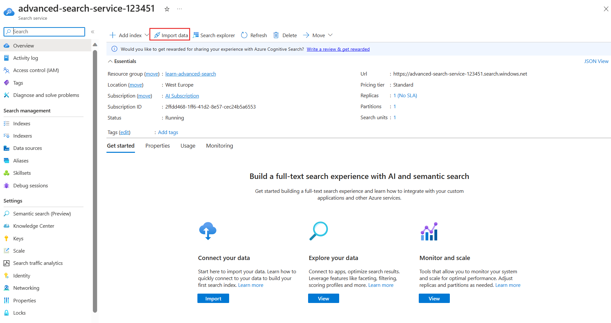
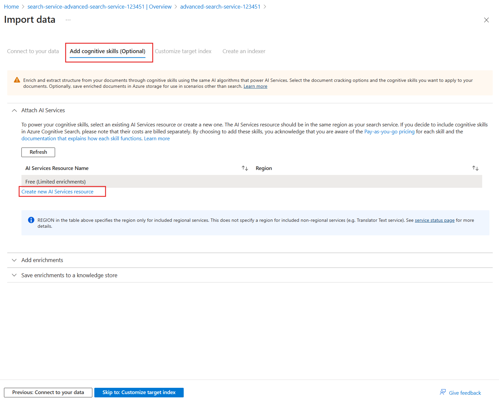

---
lab:
  title: Implementieren von Verbesserungen für Suchergebnisse
---

# Implementieren von Verbesserungen für Suchergebnisse

Sie verfügen über einen Suchdienst, der von einer App verwendet wird, über die Urlaube gebucht werden. Sie haben bemerkt, dass sich die Relevanz der Suchergebnisse auf die Anzahl der erhaltenen Buchungen auswirkt. Außerdem haben Sie kürzlich Hotels in Portugal hinzugefügt, daher möchten Sie Portugiesisch als unterstützte Sprache anbieten.

In dieser Übung fügen Sie ein Bewertungsprofil hinzu, um die Relevanz der Suchergebnisse zu steigern. Anschließend verwenden Sie Azure KI Services, um portugiesische Beschreibungen für alle Ihre Hotels hinzuzufügen.

> **Hinweis**: Um diese Übung abschließen zu können, benötigen Sie ein Microsoft Azure-Abonnement. Wenn Sie noch keines haben, können Sie sich unter [https://azure.com/free](https://azure.com/free?azure-portal=true) für eine kostenlose Testversion registrieren.

## Erstellen von Azure-Ressourcen

Sie erstellen einen Azure KI-Suche-Dienst und importieren Beispielhoteldaten.

1. Melden Sie sich beim [Azure-Portal](https://portal.azure.com/learn.docs.microsoft.com?azure-portal=true) an.
1. Wählen Sie **+ Ressource erstellen**.
1. Suchen Sie nach **Suche**, und wählen Sie dann **Azure KI-Suche** aus.
1. Klicken Sie auf **Erstellen**.
1. Wählen Sie unter „Ressourcengruppe **Neu erstellen** aus, nennen Sie diese **learn-advanced-search**.
1. Geben Sie unter **Dienstname****advanced-search-service-12345** ein. Der Name muss global eindeutig sein. Fügen Sie daher zufällige Zahlen am Ende des Namens hinzu.
1. Wählen Sie eine unterstützte Region in Ihrer Nähe aus.
1. Verwenden Sie die Standardwerte für den **Tarif**.
1. Klicken Sie auf **Überprüfen + erstellen**.
1. Klicken Sie auf **Erstellen**.
1. Warten Sie, bis die Ressourcen bereitgestellt wurden, und klicken Sie dann auf **Zu Ressource wechseln**.

### Importieren von Beispieldaten in den Suchdienst

Importieren Sie die Beispieldaten.

1. Wählen Sie im Bereich **Übersicht** die Option **Daten importieren** aus.

    
1. Wählen Sie im Bereich **Daten importieren** in der Dropdownliste **Datenquelle** die Option **Beispiele** aus.
1. Wählen Sie **hotels-sample** aus.

1. Erweitern Sie auf der Registerkarte **Kognitive Skills hinzufügen (Optional)** die Option **KI Services anfügen**, und wählen Sie dann **Neue KI Services-Ressource erstellen** aus.

    

### Erstellen eines Azure KI-Diensts zur Unterstützung von Übersetzungen

1. Melden Sie sich auf der neuen Registerkarte beim Azure-Portal an.
1. Wählen Sie unter **Ressourcengruppe****learn-advanced-search** aus.
1. Wählen Sie unter **Region** dieselbe Region aus, die Sie für den Suchdienst ausgewählt haben.
1. Geben Sie unter **Name** den Wert **learn-cognitive-translator-12345** oder einen beliebigen Namen ein, den Sie bevorzugen. Der Name muss global eindeutig sein. Fügen Sie daher zufällige Zahlen am Ende des Namens hinzu.
1. Wählen Sie **Standard S0** für **Tarif** aus.
1. Aktivieren Sie das Kontrollkästchen bei **Durch Aktivieren dieses Kontrollkästchens bestätige ich, dass ich die folgenden Bedingungen gelesen und verstanden habe**.
1. Klicken Sie auf **Überprüfen + erstellen**.
1. Klicken Sie auf **Erstellen**.
1. Schließen Sie die Registerkarte, wenn die Ressourcen erstellt wurden.

### Hinzufügen einer Übersetzungsanreicherung

1. Wählen Sie auf der Registerkarte **Kognitive Skills hinzufügen (Optional)** die Option „Aktualisieren“ aus.
1. Wählen Sie den neuen Dienst aus, **learn-cognitive-translator-12345**.
1. Erweitern Sie den Abschnitt **Anreicherungen hinzufügen**.
    
1. Wählen Sie **Text übersetzen** aus, ändern Sie die **Zielsprache** in **Portugiesisch**, und ändern Sie dann den **Feldnamen** in **Description_pt**.
1. Klicken Sie auf **Weiter: Zielindex anpassen**.

### Ändern des Felds zum Speichern von übersetztem Text

1. Scrollen Sie auf der Registerkarte **Zielindex anpassen** ans Ende der Feldliste, und ändern Sie das **Analysetool** in **Portugiesisch (Portugal) – Microsoft** für das Feld **Description_pt**.
1. Klicken Sie auf **Next: Erstellen eines Indexers**.
1. Klicken Sie auf **Submit** (Senden).

    Der Index wird erstellt, der Indexer wird ausgeführt, und 50 Dokumente mit Beispielhoteldaten werden importiert.
1. Wählen Sie im Bereich **Übersicht** die Option **Indizes** und dann **hotels-sample-index** aus.
1. Wählen Sie **Suchen** aus, um JSON-Dateien für alle Dokumente im Index anzuzeigen.
1. Suchen Sie in den Ergebnissen nach **Description_pt** (Sie können dafür **STRG+F** verwenden), und beachten Sie, dass es sich nicht um eine portugiesische Übersetzung der englischen Beschreibung handelt, sondern stattdessen wie folgt aussieht:

    ```json
    "Description_pt": "45",
    ```

Die Azure-Portal geht davon aus, dass das erste Feld im Dokument übersetzt werden muss. Daher wird der Übersetzungsskill derzeit verwendet, um die `HotelId` zu übersetzen.

### Aktualisieren des Skillset zum Übersetzen des richtigen Felds im Dokument

1. Wählen Sie oben auf der Seite den Link für den Suchdienst **advanced-search-service-12345 |Indexes** aus.
1. Wählen Sie **Skillsets** unter „Suchverwaltung“ im linken Bereich und dann **hotels-sample-skillset** aus.
1. Bearbeiten Sie das JSON-Dokument, und ändern Sie Zeile 11 in:

    ```json
    "context": "/document/Description",
    ```

1. Ändern Sie die Standardeinstellung der Sprache in „Englisch“ in Zeile 12:

    ```json
    "defaultFromLanguageCode": "en",
    ```

1. Ändern Sie das Quellfeld in Zeile 18 in:

    ```json
    "source": "/document/Description"
    ```

1. Wählen Sie **Speichern** aus.
1. Wählen Sie oben auf der Seite den Link für den Suchdienst **advanced-search-service-12345 | Skillsets** aus.
1. Wählen Sie im Bereich **Übersicht** die Option **Indexer** und dann **hotels-sample-indexer** aus.
1. Klicken Sie auf **Indexerdefinition (JSON)**.
1. Ändern Sie den Namen des Quellfelds in Zeile 21 in:

    ```json
    "sourceFieldName": "/document/Description/Description_pt",
    ```

1. Wählen Sie **Speichern** aus.
1. Wählen Sie **Zurücksetzen**und dann **Ja** aus.
1. Wahlen Sie **Ausführen** und dann **Ja** aus.

### Testen des aktualisierten Index

1. Wählen Sie oben auf der Seite den Link für den Suchdienst **advanced-search-service-12345 | Indexers** aus.
1. Wählen Sie im Bereich **Übersicht** die Option **Indizes** und dann **hotels-sample-index** aus.
1. Wählen Sie **Suchen** aus, um JSON-Dateien für alle Dokumente im Index anzuzeigen.
1. Suchen Sie in den Ergebnissen nach **Description_pt**. Sie sehen, dass jetzt eine portugiesische Beschreibung vorhanden ist.

    ```json
    "Description_pt": "O maior resort durante todo o ano da área oferecendo mais de tudo para suas férias – pelo melhor valor!  O que você pode desfrutar enquanto estiver no resort, além das praias de areia de 1,5 km do lago? Confira nossas atividades com certeza para excitar tanto os jovens quanto os jovens hóspedes do coração. Temos tudo, incluindo ser chamado de \"Propriedade do Ano\" e um \"Top Ten Resort\" pelas principais publicações.",
    ```

1. Jetzt suchen Sie nach Hotels mit Seeblick. Wir beginnen mit der Verwendung einer einfachen Suche, die nur die `HotelName`, `Description`, `Category` und `Tags` zurückgibt. Geben Sie in der **Abfragezeichenfolge** diese Suche ein:

    `lake + view&$select=HotelName,Description,Category,Tags&$count=true`

    Sehen Sie sich die Ergebnisse an, und suchen Sie nach den Feldern, die den Suchbegriffen `lake` und `view` entsprechen. Merken Sie sich dieses Hotel und seine Position:

    ```json
    {
      "@search.score": 0.9433406,
      "HotelName": "Lady Of The Lake B & B",
      "Description": "Nature is Home on the beach.  Save up to 30 percent. Valid Now through the end of the year. Restrictions and blackout may apply.",
      "Category": "Luxury",
      "Tags": [
        "laundry service",
        "concierge",
        "view"
      ]
    },
    ```

Dieses Hotel verfügt über die entsprechenden Begriffe „See“ im Feld `HotelName` und „Blick“ im Feld `Tags`. Sie möchten Übereinstimmungen von Begriffen im Feld `Description` gegenüber dem Namen des Hotels steigern. Idealerweise sollte dieses Hotel in den Ergebnissen zuletzt erscheinen.

## Hinzufügen eines Bewertungsprofils zum Verbessern der Suchergebnisse

1. Wählen Sie die Registerkarte **Bewertungsprofile** aus.
1. Wählen Sie **+ Bewertungsprofil hinzufügen** aus.
1. Geben Sie **boost-description-categories** unter **Profilname** ein.
1. Fügen Sie die folgenden Felder und Gewichtungen unter **Gewichtungen** hinzu:

    
1. Wählen Sie unter **Feldname** die Option **Beschreibung** aus.
1. Geben Sie für **Gewichtung** den Wert **5** ein.
1. Wählen Sie unter **Feldname** die Option **Kategorie** aus.
1. Geben Sie für **Gewichtung** den Wert **3** ein.
1. Wählen Sie unter **Feldname** die Option **Tags** aus.
1. Geben Sie für **Gewichtung** den Wert **2** ein.
1. Wählen Sie **Speichern**.
1. Klicken Sie oben auf **Speichern**.

### Testen des aktualisierten Index

1. Kehren Sie zur Registerkarte **Such-Explorer** der Seite **hotels-sample-index** zurück.
1. Geben Sie in der **Abfragezeichenfolge** die gleiche Suche wie zuvor ein:

    `lake + view&$select=HotelName,Description,Category,Tags&$count=true`

    Überprüfen Sie die Suchergebnisse.

    ```json
    {
      "@search.score": 3.5707965,
      "HotelName": "Lady Of The Lake B & B",
      "Description": "Nature is Home on the beach.  Save up to 30 percent. Valid Now through the end of the year. Restrictions and blackout may apply.",
      "Category": "Luxury",
      "Tags": [
        "laundry service",
        "concierge",
        "view"
      ]
    }
    ```

    Die Suchbewertung hat sich von **0,9433406** auf **3,5707965** erhöht. Alle anderen Hotels weisen jedoch ebenfalls höhere berechnete Bewertungen auf. Dieses Hotel erscheint jetzt zuletzt in den Ergebnissen.

## Löschen von Übungsressourcen

Nachdem Sie die Übung abgeschlossen haben, löschen Sie alle nicht länger benötigten Ressourcen.

1. Wählen Sie im Azure-Portal **Ressourcengruppen** aus.
1. Wählen Sie die Ressourcengruppe aus, die Sie nicht mehr benötigen, und wählen Sie dann **Ressourcengruppe löschen** aus.
