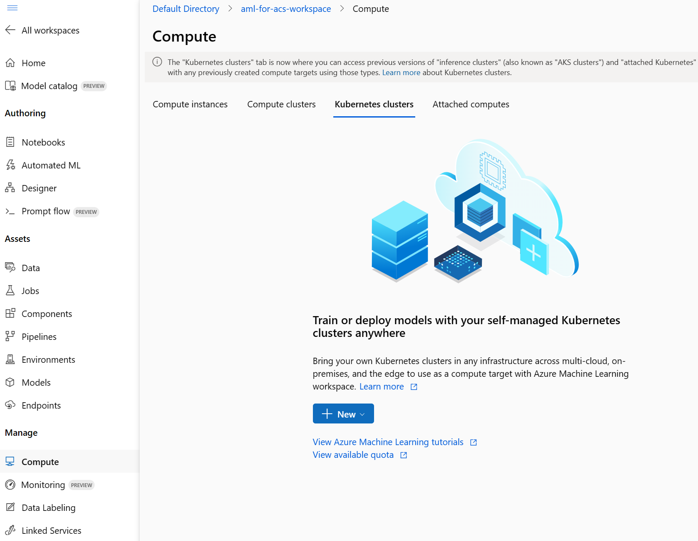
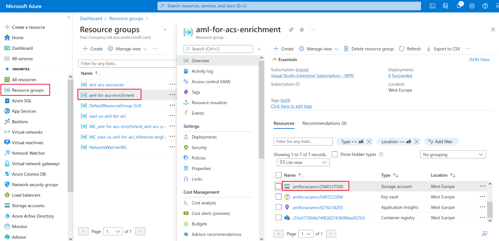

---
lab:
  title: Reichern Sie einen Suchindex mithilfe eines Azure Machine Learning-Modells an
---

# Reichern Sie einen Suchindex mithilfe eines Azure Machine Learning-Modells an

Sie können die Leistungsfähigkeit des maschinellen Lernens verwenden, um einen Suchindex anzureichern. Verwenden Sie dazu ein Modell, das in Azure Machine Learning Studio trainiert wurde, und rufen es über ein benutzerdefiniertes Skillset für das maschinelle Lernen auf.

In dieser Übung erstellen Sie ein Azure AI Machine Learning Studio-Modell, trainieren einen Endpunkt mithilfe des Modells, stellen ihn bereit und testen ihn. Anschließend erstellen Sie einen Azure Cognitive Search-Dienst, erstellen Beispieldaten und reichern einen Index mithilfe des Machine Learning Studio-Endpunkts an.

> **Hinweis** Um diese Übung abschließen zu können, benötigen Sie ein Microsoft Azure-Abonnement. Wenn Sie noch keines haben, können Sie sich unter [https://azure.com/free](https://azure.com/free?azure-portal=true) für eine kostenlose Testversion registrieren.
>

## Erstellen eines Azure Machine Learning-Arbeitsbereichs

Bevor Sie Ihren Suchindex anreichern, erstellen Sie einen Azure Machine Learning-Arbeitsbereich. Der Arbeitsbereich wird Ihnen Zugriff auf das Azure KI-Machine Learning-Studio geben, ein grafisches Tool, mit dem Sie KI-Modelle erstellen und für die Nutzung bereitstellen können.

1. Melden Sie sich im [Azure-Portal](https://portal.azure.com) an.
1. Wählen Sie **+ Ressource erstellen**.
1. Suchen Sie nach „maschinelles Lernen“, und wählen Sie dann **Azure Machine Learning** aus.
1. Klicken Sie auf **Erstellen**.
1. Wählen Sie **Neu erstellen** unter **Ressourcengruppe** aus, und nennen Sie ihn **aml-for-acs-enrichment**.
1. Geben Sie im Abschnitt „Arbeitsbereichsdetails“ für **Name** den Wert **aml-for-acs-workspace** ein.
1. Wählen Sie eine unterstützte **Region** in Ihrer Nähe aus.
1. Verwenden Sie die Standardwerte für das **Speicherkonto**, den **Schlüsseltresor**, die **Anwendungserkenntnisse** und die **Containerregistrierung**.
1. Klicken Sie auf **Überprüfen + erstellen**.
1. Klicken Sie auf **Erstellen**.
1. Warten Sie, bis der Azure Machine Learning-Arbeitsbereich bereitgestellt wird, und wählen Sie dann **Zu Ressource wechseln** aus.
1. Wählen Sie im Bereich „Übersicht“ die Option **Studio starten** aus.

## Erstellen einer Regressionstrainingspipeline

Sie erstellen jetzt ein Regressionsmodell und trainieren es mithilfe einer Azure KI Machine Learning-Studio-Pipeline. Sie trainieren Ihr Modell mit Fahrzeugpreisdaten. Nachdem das Modell trainiert wurde, wird es den Preis eines Fahrzeugs basierend auf seinen Attributen vorhersagen.

1. Wählen Sie auf der Homepage **Designer** aus.

1. Wählen Sie in der Liste der vordefinierten Komponenten **Regression - Automobile Price Prediction (Basic)** (Regression – Fahrzeugpreisvorhersage (einfach)) aus.

    

1. Wählen Sie **Überprüfen** aus.

1. Wählen Sie im Bereich **Graphvalidierung** den Fehler **Wählen Sie im Übermittlungsassistenten das Computeziel aus** aus.

    
1. Wählen Sie in der Dropdownliste **Computetyp auswählen** die Option **Compute-Instanz** aus. Wählen Sie dann darunter **Azure ML-Compute-Instanz erstellen** aus.
1. Geben Sie im Feld **Computename** einen eindeutigen Namen ein (z. B. **compute-for-training**).
1. Klicken Sie auf**Überprüfen + erstellen** und dann auf **Erstellen**.

1. Wählen Sie im Feld **Azure ML-Compute-Instanz auswählen** Ihre Instanz aus der Dropdownliste aus. Möglicherweise müssen Sie warten, bis ihre Bereitstellung abgeschlossen ist.

1. Wählen Sie erneut **Überprüfen** aus, die Pipeline sollte gut aussehen.

    
1. Wählen Sie im Bereich **Pipelineauftrag einrichten** die Option **Grundlagen** aus.
   > Hinweis: Wenn Sie den Bereich **Pipelineauftrag einrichten** zuvor ausgeblendet haben, können Sie ihn erneut öffnen, indem Sie **Konfigurieren und Übermitteln** auswählen.
1. Wählen Sie unter dem Experimentnamen **Neu erstellen** aus.
1. Geben Sie in **Name des neuen Experiments** den Namen **linear-regression-training** ein.
1. Wählen Sie **Überprüfen + Absenden** und dann **Absenden** aus.

### Erstellen eines Rückschlussclusters für den Endpunkt

Während Ihre Pipeline ein lineares Regressionsmodell trainiert, können Sie die Ressourcen erstellen, die Sie für den Endpunkt benötigen. Dieser Endpunkt benötigt einen Kubernetes-Cluster, um Webanforderungen an Ihr Modell zu verarbeiten.

1. Wählen Sie links **Compute** aus.

    
1. Wählen Sie **Kubernetes-Cluster** und dann **+ Neu** aus.
1. Wählen Sie in der Dropdownliste **AksCompute** aus.
1. Wählen Sie im Bereich **AksCompute erstellen** die Option **Neu erstellen** aus.
1. Wählen Sie für **Ort** die Region aus, die Sie auch zum Erstellen Ihrer anderen Ressourcen verwendet haben.
1. Wählen Sie in der Liste der VM-Größen die Option **Standard_A2_v2** aus.
1. Wählen Sie **Weiter** aus.
1. Geben Sie in **Computename** den Namen **aml-acs-endpoint** ein.
1. Wählen Sie **SSL-Konfiguration aktivieren** aus.
1. Geben Sie in **Blattdomäne** die Domäne **aml-for-acs** ein.
1. Klicken Sie auf **Erstellen**.

### Registrieren Ihres trainierten Modells

Ihr Pipelineauftrag sollte abgeschlossen sein. Sie laden die Dateien `score.py` und `conda_env.yaml` herunter. Anschließend registrieren Sie Ihr trainiertes Modell.

1. Wählen Sie links die Option **Aufträge** aus.

    
1. Wählen Sie Ihr Experiment aus, und wählen Sie dann Ihren abgeschlossenen Auftrag in der Tabelle aus, z. B. **Regression – Fahrzeugpreisvorhersage (Basic)**. Wenn Sie aufgefordert werden, Änderungen zu speichern, wählen Sie für Änderungen **Verwerfen** aus.
1. Wählen Sie im Designer oben rechts die **Auftragsübersicht** und dann den Knoten **Modell trainieren** aus.

    
1. Erweitern Sie auf der Registerkarte **Ausgaben + Protokolle** den Ordner **trained_model_outputs**.
1. Wählen Sie neben `score.py` das Menü „mehr“ (**...**) und dann **Herunterladen** aus.
1. Wählen Sie neben `conda_env.yaml` das Menü „mehr“ (**...**) und dann **Herunterladen** aus.
1. Wählen Sie oben auf der Registerkarte **+ Modell registrieren** aus.
1. Wählen Sie im Feld **Auftragsausgabe** den Ordner **trained_model_outputs** aus. Wählen Sie dann unten im Bereich **Weiter** aus.
1. Geben Sie für den **Namen** des Modells **carevalmodel** ein.
1. Geben Sie in **Beschreibung** den Text **Ein lineares Regressionsmodell, um den Preis von Fahrzeugen vorherzusagen** ein.
1. Wählen Sie **Weiter** aus.
1. Wählen Sie **Registrieren** aus.

### Bearbeiten des Bewertungsskripts, um richtig auf Azure KI-Suche zu reagieren

Das Azure Machine Learning-Studio hat zwei Dateien in den Standard-Downloadspeicherort Ihres Webbrowsers heruntergeladen. Sie müssen die score.py-Datei bearbeiten, um zu ändern, wie die JSON-Anforderung und -Antwort behandelt werden. Sie können einen Text-Editor oder einen Code-Editor wie Visual Studio Code verwenden.

1. Öffnen Sie in Ihrem Editor die Datei score.py.
1. Ersetzen Sie den gesamten Inhalt der Ausführungsfunktion:

    ```python
    def run(data):
    data = json.loads(data)
    input_entry = defaultdict(list)
    for row in data:
        for key, val in row.items():
            input_entry[key].append(decode_nan(val))

    data_frame_directory = create_dfd_from_dict(input_entry, schema_data)
    score_module = ScoreModelModule()
    result, = score_module.run(
        learner=model,
        test_data=DataTable.from_dfd(data_frame_directory),
        append_or_result_only=True)
    return json.dumps({"result": result.data_frame.values.tolist()})
    ```

    Durch diesen Python-Code:

    ```python
    def run(data):
        data = json.loads(data)
        input_entry = defaultdict(list)
        
        for key, val in data.items():
                input_entry[key].append(decode_nan(val))
    
        data_frame_directory = create_dfd_from_dict(input_entry, schema_data)
        score_module = ScoreModelModule()
        result, = score_module.run(
            learner=model,
            test_data=DataTable.from_dfd(data_frame_directory),
            append_or_result_only=True)
        output = result.data_frame.values.tolist()
        
        return {
                "predicted_price": output[0][-1]
        }    
    ```

    Die obigen Änderungen ermöglichen es dem Modus, ein einzelnes JSON-Objekt mit Fahrzeugattributen anstelle eines Arrays von Fahrzeugen zu empfangen.

    Die andere Änderung besteht darin, nur den vorhergesagten Preis des Fahrzeugs anstelle der gesamten JSON-Antwort zurückzugeben.
1. Speichern Sie die Änderungen im Text-Editor.

## Erstellen einer benutzerdefinierten Umgebung

Als Nächstes erstellen Sie eine benutzerdefinierte Umgebung, damit Sie auf einem Echtzeitendpunkt bereitstellen können.

1. Wählen Sie im Navigationsbereich **Umgebungen** aus.
1. Wählen Sie die Registerkarte **Benutzerdefinierte Umgebungen** aus.
1. Wählen Sie **+ Erstellen** aus.
1. Geben Sie für **Name** den Wert **my-custom-environment** ein.
1. Wählen Sie in der Liste *Kuratierte Umgebungen* unter **Umgebungstyp auswählen** die neueste Version von **automl-gpu** aus.
1. Wählen Sie **Weiter** aus.
1. Öffnen Sie auf Ihrem lokalen Computer die `conda_env.yaml`-Datei, die Sie zuvor heruntergeladen haben, und kopieren Sie ihren Inhalt.
1. Kehren Sie zum Browser zurück, und wählen Sie im Bereich „Anpassen“ den Wert **conda_dependencies.yaml** aus.
1. Ersetzen Sie im Bereich auf der rechten Seite den Inhalt durch den Code, den Sie zuvor kopiert haben.
1. Wählen Sie **Weiter** und dann erneut **Weiter** aus.
1. Wählen Sie **Erstellen** aus, um Ihre benutzerdefinierte Umgebung zu erstellen.

## Bereitstellen des Modells mit dem aktualisierten Bewertungscode <!--Option for web service deployment is greyed out. Can't go further after trying several different things.-->

Ihr Rückschlusscluster sollte jetzt einsatzbereit sein. Sie haben auch den Bewertungscode bearbeitet, um Anforderungen aus Ihrem benutzerdefinierten Azure Cognitive Search-Skillset zu behandeln. Erstellen und testen wir einen Endpunkt für das Modell.

1. Wählen Sie links die Option **Modelle** aus.
1. Wählen Sie das von Ihnen registrierte Modell **carevalmodel** aus.

1. Wählen Sie **Bereitstellen** und dann **Echtzeitendpunkt** aus.

    
1. Geben Sie für **Name** einen eindeutigen Namen ein, z. B. **car-evaluation-endpoint-1440637584**.
1. Wählen Sie für **Computetyp** die Option **Verwaltet** aus.
1. Wählen Sie für **Authentifizierungstyp** die **schlüsselbasierte Authentifizierung** aus.
1. Wählen Sie **Weiter** und dann **Weiter** aus.
1. Wählen Sie erneut **Weiter** aus.
1. Browsen Sie im Feld **Auswahl eines Bewertungsskripts für Rückschließen** zu Ihrer aktualisierten `score.py`-Datei, und wählen Sie diese aus.
1. Wählen Sie im Dropdownmenü **Umgebungstyp auswählen** die Option **Benutzerdefinierte Umgebung** aus.
1. Aktivieren Sie das Kontrollkästchen für Ihre benutzerdefinierte Umgebung in der Liste.
1. Wählen Sie **Weiter** aus.
1. Wählen Sie für VM den Wert **Standard_D2as_v4** aus.
1. Stellen Sie die **Anzahl der Instanzen** auf **1** ein.
1. Wählen Sie **Weiter** und dann erneut **Weiter** aus.
1. Klicken Sie auf **Erstellen**.

Warten Sie, bis das Modell bereitgestellt ist; das kann bis zu 10 Minuten dauern. Sie können den Status unter **Benachrichtigungen** oder im Abschnitt „Endpunkte“ im Azure Machine Learning-Studio überprüfen.

### Testen des Endpunkts des trainierten Modells

1. Klicken Sie links auf **Endpunkte**.
1. Wählen Sie **car-evaluation-endpoint** aus.
1. Wählen Sie **Testen** aus, und fügen Sie in **Daten zum Testen des Endpunkts eingeben** diesen Beispiel-JSON-Code ein.

    ```json
    {
        "symboling": 2,
        "make": "mitsubishi",
        "fuel-type": "gas",
        "aspiration": "std",
        "num-of-doors": "two",
        "body-style": "hatchback",
        "drive-wheels": "fwd",
        "engine-location": "front",
        "wheel-base": 93.7,
        "length": 157.3,
        "width": 64.4,
        "height": 50.8,
        "curb-weight": 1944,
        "engine-type": "ohc",
        "num-of-cylinders": "four",
        "engine-size": 92,
        "fuel-system": "2bbl",
        "bore": 2.97,
        "stroke": 3.23,
        "compression-ratio": 9.4,
        "horsepower": 68.0,
        "peak-rpm": 5500.0,
        "city-mpg": 31,
        "highway-mpg": 38,
        "price": 0.0
    }
    ```

1. Wählen Sie **Testen** aus, und Sie sollten eine Antwort sehen:

    ```json
    {
        "predicted_price": 5852.823214312815
    }
    ```

1. Wählen Sie **Nutzen** aus.

    
1. Kopieren Sie den **REST-Endpunkt**.
1. Kopieren Sie den **Primärschlüssel**.

### Integrieren eines Azure Machine Learning-Modells mit Azure KI-Suche

Als nächstes erstellen Sie einen neuen Cognitive Search-Dienst und reichern einen Index mit einem benutzerdefinierten Skillset an.

### Erstellen einer Testdatei

1. Wählen Sie im [Azure-Portal](https://portal.azure.com/learn.docs.microsoft.com?azure-portal=true) die Option „Ressourcengruppen“ aus.
1. Wählen Sie **aml-for-acs-enrichment** aus.

    
1. Wählen Sie das Speicherkonto aus, z. B. **amlforacsworks1440637584**.
1. Wählen Sie unter **Einstellungen** die Option **Konfiguration** aus. Legen Sie dann **Anonymen Blob-Zugriff zulassen** auf **Aktiviert** fest.
1. Wählen Sie **Speichern**.
1. Wählen Sie unter **Datenspeicher** die Option **Container** aus. 
1. Erstellen Sie einen neuen Container zum Speichern von Indexdaten; wählen Sie **+ Container** aus.
1. Geben Sie im Bereich **Neuer Container** unter **Name** den Namen **docs-to-search** ein.
1. Wählen Sie unter **Anonyme Zugriffsebene** die Option **Container (Anonymer Lesezugriff für Container und Blobs)** aus.
1. Klicken Sie auf **Erstellen**.
1. Wählen Sie den von Ihnen erstellten **docs-to-search**-Container aus.
1. Erstellen Sie in einem Text-Editor ein JSON-Dokument:

    ```json
    {
      "symboling": 0,
      "make": "toyota",
      "fueltype": "gas",
      "aspiration": "std",
      "numdoors": "four",
      "bodystyle": "wagon",
      "drivewheels": "fwd",
      "enginelocation": "front",
      "wheelbase": 95.7,
      "length": 169.7,
      "width": 63.6,
      "height": 59.1,
      "curbweight": 2280,
      "enginetype": "ohc",
      "numcylinders": "four",
      "enginesize": 92,
      "fuelsystem": "2bbl",
      "bore": 3.05,
      "stroke": 3.03,
      "compressionratio": 9.0,
      "horsepower": 62.0,
      "peakrpm": 4800.0,
      "citympg": 31,
      "highwaympg": 37,
      "price": 0
    }
    ```

    Speichern Sie das Dokument als `test-car.json`-Erweiterung auf Ihrem Computer.
1. Wählen Sie im Portal **Hochladen** aus.
1. Wählen Sie im Bereich **Blob hochladen** die Option **Nach Dateien durchsuchen** aus, navigieren Sie zu dem Ort, an dem Sie das JSON-Dokument gespeichert haben, und wählen Sie es aus.
1. Wählen Sie die Option **Hochladen**.

### Erstellen einer Azure KI-Suche-Ressource

1. Wählen Sie im Azure-Portal auf der Homepage **+ Ressource erstellen** aus.
1. Suchen Sie nach **Azure KI-Suche**, und wählen Sie dann **Azure KI-Suche** aus.
1. Klicken Sie auf **Erstellen**.
1. Wählen Sie in **Ressourcengruppe** die Option **aml-for-acs-enrichment** aus.
1. Geben Sie unter „Dienstname“ einen eindeutigen Namen ein, z. B. **acs-enriched-1440637584**.
1. Wählen Sie für **Ort** dieselbe Region aus, die Sie zuvor verwendet haben.
1. Klicken Sie auf**Überprüfen + erstellen** und dann auf **Erstellen**.
1. Warten Sie, bis die Ressourcen bereitgestellt wurden, und klicken Sie dann auf **Zu Ressource wechseln**.
1. Klicken Sie auf **Daten importieren**.
1. Wählen Sie im Bereich **Mit Ihren Daten verbinden** für das Feld **Datenquelle** die Option **Azure Blob Storage** aus.
1. Geben Sie unter **Datenquellenname** den Wert **import-docs** ein.
1. Wählen Sie in **Analysemodus** die Option **JSON** aus.
1. Wählen Sie in **Verbindungszeichenfolge** die Option **Vorhandene Verbindung auswählen** aus.
1. Wählen Sie das Speicherkonto aus, in das Sie hochgeladen haben, z. B. **amlforacsworks1440637584**.
1. Wählen Sie im Bereich **Container** die Option **docs-to-search** aus. 
1. Wählen Sie **Auswählen** aus.
1. Wählen Sie **Weiter: Kognitive Skills hinzufügen (optional)** aus.

### Hinzufügen von kognitiven Qualifikationen

1. Erweitern Sie **Anreicherungen hinzufügen**, und wählen Sie dann **Personennamen extrahieren** aus.
1. Klicken Sie auf **Weiter: Zielindex anpassen**.
1. Wählen Sie **+ Feld hinzufügen** aus, geben Sie im **Feldnamen** den Wert **predicted_price** am Ende der Liste ein.
1. Wählen Sie in **Typ** den Wert **Edm.Double** für Ihren neuen Eintrag aus.
1. Wählen Sie **Abrufbar** für alle Felder aus.
1. Wählen Sie **Durchsuchbar** für **erstellen** aus.
1. Klicken Sie auf **Next: Erstellen eines Indexers**.
1. Klicken Sie auf **Submit** (Senden).

## Hinzufügen der AML-Qualifikation zum Skillset

Sie ersetzen nun die Personennamenanreicherung durch das benutzerdefinierte Azure Machine Learning-Skillset.

1. Wählen Sie im Bereich „Übersicht“ unter **Suchverwaltung** die Option **Skillsets** aus.
1. Wählen Sie unter **Name** die Option **azureblob-skillset** aus.
1. Ersetzen Sie die Skilldefinition für `EntityRecognitionSkill` durch diesen JSON-Code; denken Sie daran, Ihren kopierten Endpunkt und Primärschlüsselwerte zu ersetzen:

    ```json
    "@odata.type": "#Microsoft.Skills.Custom.AmlSkill",
    "name": "AMLenricher",
    "description": "AML studio enrichment example",
    "context": "/document",
    "uri": "PASTE YOUR AML ENDPOINT HERE",
    "key": "PASTE YOUR PRIMARY KEY HERE",
    "resourceId": null,
    "region": null,
    "timeout": "PT30S",
    "degreeOfParallelism": 1,
    "inputs": [
      {
        "name": "symboling",
        "source": "/document/symboling"
      },
      {
        "name": "make",
        "source": "/document/make"
      },
      {
        "name": "fuel-type",
        "source": "/document/fueltype"
      },
      {
        "name": "aspiration",
        "source": "/document/aspiration"
      },
      {
        "name": "num-of-doors",
        "source": "/document/numdoors"
      },
      {
        "name": "body-style",
        "source": "/document/bodystyle"
      },
      {
        "name": "drive-wheels",
        "source": "/document/drivewheels"
      },
      {
        "name": "engine-location",
        "source": "/document/enginelocation"
      },
      {
        "name": "wheel-base",
        "source": "/document/wheelbase"
      },
      {
        "name": "length",
        "source": "/document/length"
      },
      {
        "name": "width",
        "source": "/document/width"
      },
      {
        "name": "height",
        "source": "/document/height"
      },
      {
        "name": "curb-weight",
        "source": "/document/curbweight"
      },
      {
        "name": "engine-type",
        "source": "/document/enginetype"
      },
      {
        "name": "num-of-cylinders",
        "source": "/document/numcylinders"
      },
      {
        "name": "engine-size",
        "source": "/document/enginesize"
      },
      {
        "name": "fuel-system",
        "source": "/document/fuelsystem"
      },
      {
        "name": "bore",
        "source": "/document/bore"
      },
      {
        "name": "stroke",
        "source": "/document/stroke"
      },
      {
        "name": "compression-ratio",
        "source": "/document/compressionratio"
      },
      {
        "name": "horsepower",
        "source": "/document/horsepower"
      },
      {
        "name": "peak-rpm",
        "source": "/document/peakrpm"
      },
      {
        "name": "city-mpg",
        "source": "/document/citympg"
      },
      {
        "name": "highway-mpg",
        "source": "/document/highwaympg"
      },
      {
        "name": "price",
        "source": "/document/price"
      }
    ],
    "outputs": [
      {
        "name": "predicted_price",
        "targetName": "predicted_price"
      }
    ]  
    ```

1. Wählen Sie **Speichern** aus.

### Aktualisieren der Ausgabefeldzuordnungen

1. Wechseln Sie zurück zum Bereich **Übersicht** und wählen **Indexer** aus, dann wählen Sie den **azureblob-indexer** aus.
1. Wählen Sie die Registerkarte **Indexerdefinition (JSON)** aus, und ändern Sie dann den Wert **outputFieldMappings** in:

    ```json
    "outputFieldMappings": [
        {
          "sourceFieldName": "/document/predicted_price",
          "targetFieldName": "predicted_price"
        }
      ]
    ```

1. Wählen Sie **Speichern** aus.
1. Klicken Sie auf **Zurücksetzen**, und wählen Sie **Ja** aus.
1. Klicken Sie auf **Ausführen**, und wählen Sie **Ja** aus.

## Testen der Indexanreicherung

Das aktualisierte Skillset fügt nun dem Testfahrzeugdokument in Ihrem Index einen vorhergesagten Wert hinzu. Gehen Sie zum Testen wie folgt vor:

1. Wählen Sie im Bereich **Übersicht** Ihres Suchdiensts oben im Bereich **Such-Explorer** aus.
1. Klicken Sie auf **Suchen**.
1. Scrollen Sie zum Ende der Ergebnisse.
    
Das Auffüllfeld `predicted_price` sollte angezeigt werden.

## Löschen von Übungsressourcen

Nachdem Sie die Übung abgeschlossen haben, löschen Sie alle nicht länger benötigten Ressourcen. Löschen der Azure-Ressourcen:

1. Wählen Sie im **Azure-Portal** die Option „Ressourcengruppen“ aus.
1. Wählen Sie die Ressourcengruppe aus, die Sie nicht benötigen, und wählen Sie dann **Ressourcengruppe löschen** aus.
