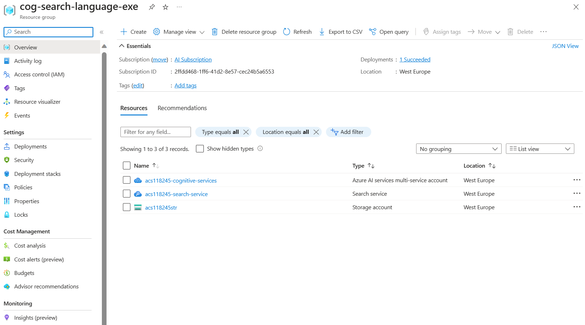

---
lab:
  title: Hinzufügen zu einem Index mithilfe der Push-API
---

# Hinzufügen zu einem Index mithilfe der Push-API

Hier erfahren Sie, wie Sie mithilfe von C#-Code einen Azure KI-Suche-Index erstellen und Dokumente in diesen Index hochladen.

In dieser Übung klonen Sie eine vorhandene C#-Lösung und führen sie aus, um die optimale Batchgröße zum Hochladen von Dokumenten zu ermitteln. Anschließend verwenden Sie diese Batchgröße und laden Dokumente mithilfe eines Threadingansatzes effektiv hoch.

> **Hinweis** Um diese Übung abschließen zu können, benötigen Sie ein Microsoft Azure-Abonnement. Wenn Sie noch kein Abonnement besitzen, können Sie sich unter [https://azure.com/free](https://azure.com/free?azure-portal=true) für eine kostenlose Testversion registrieren.

## Einrichten Ihrer Azure-Ressourcen

Um Zeit zu sparen, wählen Sie diese ARM-Vorlage aus, um Ressourcen zu erstellen, die Sie später in der Übung benötigen:

1. [Bereitstellen von Ressourcen in Azure](https://portal.azure.com/#create/Microsoft.Template/uri/https%3A%2F%2Fraw.githubusercontent.com%2FMicrosoftLearning%2Fmslearn-knowledge-mining%2Fmain%2FLabfiles%2F07-exercise-add-to-index-use-push-api%2Fazuredeploy.json) – Wählen Sie diesen Link aus, um Ihre Azure AI-Ressourcen zu erstellen.
    
1. Klicken Sie unter **Ressourcengruppe** auf **Neu erstellen**, und nennen Sie die Ressourcengruppe **cog-search-language-exe**.
1. Wählen Sie unter **Region** eine [unterstützte Region](/azure/ai-services/language-service/custom-text-classification/service-limits#regional-availability) aus, die sich in Ihrer Nähe befindet.
1. Das **Ressourcenpräfix** muss global eindeutig sein. Geben Sie ein Präfix aus zufälligen Zahlen und Kleinbuchstaben ein (z. B. **acs118245**).
1. Wählen Sie unter **Standort** dieselbe Region aus wie zuvor.
1. Klicken Sie auf **Überprüfen + erstellen**.
1. Klicken Sie auf **Erstellen**.
1. Wenn die Bereitstellung abgeschlossen ist, klicken Sie auf **Zu Ressourcengruppe wechseln**, um alle erstellten Ressourcen anzuzeigen.

    

## Kopieren von REST-API-Informationen für einen Azure KI-Suche-Dienst

1. Wählen Sie in der Liste der Ressourcen den von Ihnen erstellten Suchdienst aus. Im obigen Beispiel ist dies **acs118245-search-service**.
1. Kopieren Sie den Suchdienstnamen in eine Textdatei.

    
1. Wählen Sie auf der linken Seite **Schlüssel** aus, und kopieren Sie dann den **primären Administratorschlüssel** in dieselbe Textdatei.

## Klonen des Repositorys in Cloud Shell

Sie entwickeln Ihren Code mithilfe von Cloud Shell aus dem Azure-Portal. Die Codedateien für Ihre App wurden in einem GitHub-Repository bereitgestellt.

> **Tipp**: Wenn Sie das Repository **mslearn-knowledge-mining** bereits vor Kurzem geklont haben, können Sie diese Aufgabe überspringen. Führen Sie andernfalls die folgenden Schritte aus, um es in Ihrer Entwicklungsumgebung zu klonen.

1. Verwenden Sie im Azure-Portal die Schaltfläche **[\>_]** rechts neben der Suchleiste oben auf der Seite, um eine neue Cloud Shell im Azure-Portal zu erstellen, und wählen Sie eine ***PowerShell***-Umgebung aus. Die Cloud Shell bietet eine Befehlszeilenschnittstelle in einem Bereich am unteren Rand des Azure-Portals.

    > **Hinweis**: Wenn Sie zuvor eine Cloud-Shell erstellt haben, die eine *Bash*-Umgebung verwendet, wechseln Sie zu ***PowerShell***.

1. Wählen Sie in der Cloud Shell-Symbolleiste im Menü **Einstellungen** das Menüelement **Zur klassischen Version wechseln** aus (dies ist für die Verwendung des Code-Editors erforderlich).

    > **Tipp**: Wenn Sie Befehle in die Cloudshell einfügen, kann die Ausgabe einen großen Teil des Bildschirmpuffers einnehmen. Sie können den Bildschirm löschen, indem Sie den Befehl `cls` eingeben, um sich besser auf die einzelnen Aufgaben konzentrieren zu können.

1. Geben Sie im PowerShell-Bereich die folgenden Befehle ein, um das GitHub-Repository für diese Übung zu klonen:

    ```
    rm -r mslearn-knowledge-mining -f
    git clone https://github.com/microsoftlearning/mslearn-knowledge-mining mslearn-knowledge-mining
    ```

1. Navigieren Sie nach dem Klonen des Repositorys zu dem Ordner, der die Codedateien der Anwendung enthält:  

    ```
   cd mslearn-knowledge-mining/Labfiles/07-exercise-add-to-index-use-push-api/OptimizeDataIndexing
    ```

## Einrichten der Anwendung

1. Mit dem Befehl `ls` können Sie den Inhalt des Ordners **OptimizeDataIndexing** anzeigen. Beachten Sie, dass er eine `appsettings.json`-Datei für Konfigurationseinstellungen enthält.

1. Geben Sie den folgenden Befehl ein, um die bereitgestellte Konfigurationsdatei zu bearbeiten:

    ```
   code appsettings.json
    ```

    Die Datei wird in einem Code-Editor geöffnet.

    

1. Fügen Sie ihren Suchdienstnamen und den primären Administratorschlüssel ein.

    ```json
    {
      "SearchServiceUri": "https://acs118245-search-service.search.windows.net",
      "SearchServiceAdminApiKey": "YOUR_SEARCH_SERVICE_KEY",
      "SearchIndexName": "optimize-indexing"
    }
    ```

    Die Datei mit den Einstellungen sollte in etwa wie oben gezeigt aussehen.
   
1. Nachdem Sie die Platzhalter ersetzt haben, verwenden Sie den Befehl **STRG+S**, um Ihre Änderungen zu speichern, und verwenden Sie dann den Befehl **STRG+Q**, um den Code-Editor zu schließen, während die Befehlszeile der Cloud Shell geöffnet bleibt.
1. Geben Sie im Terminal `dotnet run` ein und drücken Sie die **Eingabetaste**.

    

    Die Ausgabe zeigt, dass in diesem Fall die beste Batchgröße 900 Dokumente mit der höchsten Übertragungsrate (MB/Sekunde) ist.
   
    >**Hinweis:** Ihre Übertragungsratenwerte können von den im Screenshot angezeigten Werten abweichen. Die optimale Batchgröße sollte jedoch weiterhin identisch sein. 

## Bearbeiten des Codes zum Implementieren von Threading und einer Backoff- und Wiederholungsstrategie

Code wurde auskommentiert und ist bereit dafür, die App so zu ändern, dass Threads zum Hochladen von Dokumenten in den Suchindex verwendet werden können.

1. Geben Sie den folgenden Befehl ein, um die Codedatei für die Clientanwendung zu öffnen:

    ```
   code Program.cs
    ```

1. Kommentieren Sie die Zeilen 38 und 39 wie folgt aus:

    ```csharp
    //Console.WriteLine("{0}", "Finding optimal batch size...\n");
    //await TestBatchSizesAsync(searchClient, numTries: 3);
    ```

1. Heben Sie die Auskommentierung der Zeilen 41 bis 49 auf.

    ```csharp
    long numDocuments = 100000;
    DataGenerator dg = new DataGenerator();
    List<Hotel> hotels = dg.GetHotels(numDocuments, "large");

    Console.WriteLine("{0}", "Uploading using exponential backoff...\n");
    await ExponentialBackoff.IndexDataAsync(searchClient, hotels, 1000, 8);

    Console.WriteLine("{0}", "Validating all data was indexed...\n");
    await ValidateIndexAsync(indexClient, indexName, numDocuments);
    ```

    Der Code, der die Batchgröße und die Anzahl der Threads steuert, lautet `await ExponentialBackoff.IndexDataAsync(searchClient, hotels, 1000, 8)`. Die Batchgröße beträgt 1.000, und es gibt acht Threads.

    

    Der Code sollte wie das obenstehende Beispiel aussehen.

1. Speichern Sie die Änderungen.
1. Wählen Sie Ihr Terminal aus, und drücken Sie dann eine beliebige Taste, um den laufenden Prozess zu beenden, falls noch nicht geschehen.
1. Führen Sie `dotnet run` im Terminal aus.

    Die App startet acht Threads, immer wenn ein Thread das Schreiben einer neuen Nachricht in die Konsole abgeschlossen hat:

    ```powershell
    Finished a thread, kicking off another...
    Sending a batch of 1000 docs starting with doc 57000...
    ```

    Nach dem Hochladen von 100.000 Dokumenten schreibt die App eine Zusammenfassung (dies kann eine Weile dauern):

    ```powershell
    Ended at: 9/1/2023 3:25:36 PM
    
    Upload time total: 00:01:18:0220862
    Upload time per batch: 780.2209 ms
    Upload time per document: 0.7802 ms
    
    Validating all data was indexed...
    
    Waiting for service statistics to update...
    
    Document Count is 100000
    
    Waiting for service statistics to update...
    
    Index Statistics: Document Count is 100000
    Index Statistics: Storage Size is 71453102
    
    ``````

Durchsuchen Sie den Code in der `TestBatchSizesAsync`-Prozedur, um zu erfahren, wie der Code die Leistung der Batchgröße überprüft.

Durchsuchen Sie den Code in der `IndexDataAsync`-Prozedur, um zu sehen, wie der Code das Threading verwaltet.

Durchsuchen Sie den Code im `ExponentialBackoffAsync`, um zu sehen, wie der Code eine exponentielle Backoff-Wiederholungsstrategie implementiert.

Sie können das Azure-Portal durchsuchen und dort überprüfen, ob die Dokumente dem Index hinzugefügt wurden.


## Bereinigung

Nachdem Sie die Übung abgeschlossen haben, löschen Sie alle nicht länger benötigten Ressourcen. Beginnen Sie mit dem Code, der auf Ihrem Computer geklont ist. Löschen Sie dann die Azure-Ressourcen.

1. Wählen Sie im **Azure-Portal** die Option „Ressourcengruppen“ aus.
1. Wählen Sie die Ressourcengruppe aus, die Sie für diese Übung erstellt haben.
1. Wählen Sie die Option **Ressourcengruppe löschen**. 
1. Bestätigen Sie den Löschvorgang, und wählen Sie dann **Löschen** aus.
1. Wählen Sie die Ressourcen aus, die Sie nicht mehr benötigen, und klicken Sie auf **Löschen**.
