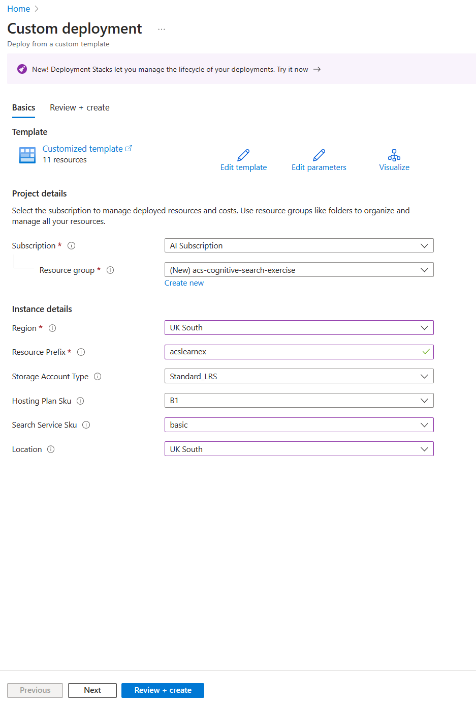
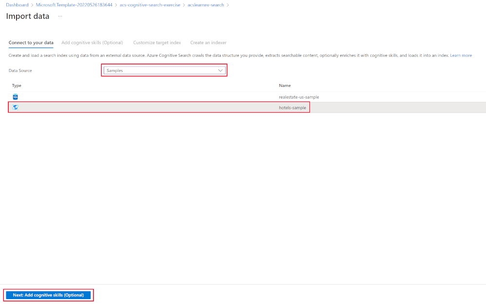

---
lab:
  title: Debuggen von Suchproblemen
---

# Debuggen von Suchproblemen

Sie haben Ihre Suchlösung erstellt, aber es gibt einige Warnungen im Indexer.

In dieser Übung erstellen Sie eine Azure KI-Suche-Lösung, importieren einige Beispieldaten, und beheben dann eine Warnung im Indexer.

> **Hinweis**: Um diese Übung abschließen zu können, benötigen Sie ein Microsoft Azure-Abonnement. Wenn Sie noch keines haben, können Sie sich unter [https://azure.com/free](https://azure.com/free?azure-portal=true) für eine kostenlose Testversion registrieren.

## Erstellen Ihrer Suchlösung

Bevor Sie mit einer Debugsitzung beginnen können, müssen Sie einen Azure Cognitive Search-Dienst erstellen.

1. [Bereitstellen von Ressourcen in Azure](https://portal.azure.com/#create/Microsoft.Template/uri/https%3A%2F%2Fraw.githubusercontent.com%2FMicrosoftLearning%2Fmslearn-knowledge-mining%2Fmain%2FLabfiles%2F08-debug-search%2Fazuredeploy.json) – Wählen Sie diesen Link aus, um alle Ressourcen bereitzustellen, die Sie im Azure-Portal benötigen.

    

1. Klicken Sie unter **Ressourcengruppe** auf die Option **Neu erstellen**.
1. Geben Sie **acs-cognitive-search-exercise** ein.
1. Wählen Sie die **Region** aus, die Ihnen am nächsten liegt.
1. Geben Sie für das **Ressourcenpräfix** den Wert **acslearnex** ein, und fügen Sie eine zufällige Kombination aus Zahlen oder Zeichen hinzu, um sicherzustellen, dass der Speichername eindeutig ist.
1. Wählen Sie für „Standort“ dieselbe Region aus, die Sie oben verwendet haben.
1. Klicken Sie im unteren Bereich auf **Überprüfen und erstellen**.
1. Warten Sie, bis die Ressource bereitgestellt wurde, und wählen Sie dann **Zu Ressourcengruppe wechseln** aus.

## Importieren von Beispieldaten

Da Ihre Ressourcen erstellt wurden, können Sie jetzt Ihre Quelldaten importieren.

1. Wählen Sie in den aufgelisteten Ressourcen den Suchdienst aus.

1. Wählen Sie im Bereich **Übersicht** die Option **Daten importieren** aus.

      

1. Wählen Sie im Bereich „Daten importieren“ die Datenquelle **Samples** aus.

      

1. Wählen Sie **hotels-sample** aus der Liste der Beispiele aus.
1. Wählen Sie **Weiter: Kognitive Skills hinzufügen (optional)** aus.
1. Erweitern Sie den Abschnitt **Anreicherungen hinzufügen**.

    

1. Wählen Sie **Kognitive Fähigkeiten für Text** aus.
1. Wählen Sie **Weiter: Zielindex anpassen** aus.
1. Übernehmen Sie die Standardwerte, und wählen Sie **Weiter: Indexer erstellen** aus.
1. Klicken Sie auf **Submit** (Senden).

## Verwenden einer Debugsitzung zum Beheben von Warnungen in Ihrem Indexer

Der Indexer beginnt nun damit, 50 Dokumente zu erfassen. Wenn Sie jedoch den Status des Indexers überprüfen, sehen Sie, dass Warnungen vorhanden sind.

1. Wählen Sie **Debugsitzung** im linken Bereich aus.

1. Wählen Sie **+ Debugsitzung hinzufügen** aus.

1. Wählen Sie für die Storage-Verbindungszeichenfolge **Vorhandene Verbindung verwenden** und dann Ihr Speicherkonto aus.

    
1. Wählen Sie **+ Container** aus, um einen neuen Container hinzuzufügen. Benennen Sie ihn **acs-debug-storage**.

    

1. Legen Sie die **Anonyme Zugriffsebene** auf **Container(anonymer Lesezugriff für Container und Blobs)** fest.

    > **Hinweis:** Möglicherweise müssen Sie anonymen Blobzugriff aktivieren, um diese Option auszuwählen. Wechseln Sie dazu im Speicherkonto zu **Konfiguration**, legen Sie **Anonymen Blobzugriff zulassen** auf **Aktiviert** fest, und wählen Sie dann **Speichern** aus.

1. Klicken Sie auf **Erstellen**.
1. Wählen Sie Ihren neuen Container in der Liste aus, und wählen Sie dann **Auswählen** aus.
1. Wählen Sie **hotel-sample-indexer** als **Indexervorlage** aus.
1. Wählen Sie **Sitzung speichern** aus.

    Das Abhängigkeitsdiagramm zeigt Ihnen, dass für jedes Dokument ein Fehler zu drei Skills vorhanden ist.
    

1. Wählen Sie **V3** aus.
1. Wählen Sie im Bereich „Skills details“ (Skilldetails) **Fehler/Warnungen (1)** aus.
1. Erweitern Sie die Spalte **Meldung**, damit die Details angezeigt werden.

    Die Details lauten:

    *Ungültiger Sprachcode „(Unbekannt)“. Unterstützte Sprachen: ar,cs,da,de,en,es,fi,fr,hu,it,ja,ko,nl,no,pl,pt-BR,pt-PT,ru,sv,tr,zh-Hans. Weitere Informationen finden Sie unter https://aka.ms/language-service/language-support.*

    Wenn Sie sich nun wieder das Abhängigkeitsdiagramm ansehen, weist der Skill „Spracherkennung“ Ausgaben für die drei Skills mit Warnungen auf. Die Skilleingabe, die den Fehler verursacht, ist `languageCode`.

1. Wählen Sie im Abhängigkeitsdiagramm **Spracherkennung** aus.

    
    Beachten Sie in der JSON-Datei für Skilleinstellungen, dass `HotelId` als Feld für die Ableitung der Sprache verwendet wird.

    Dieses Feld verursacht den Fehler, da der Skill die Sprache nicht aus einer ID ableiten kann.

## Beheben der Warnung im Indexer

1. Wählen Sie unter „Eingaben“ die Option **Quelle** aus, und ändern Sie das Feld in `/document/Description`.
    
1. Wählen Sie **Speichern** aus.
1. Klicken Sie auf **Run** (Ausführen).

    

    Der Indexer sollte keine Fehler oder Warnungen mehr haben. Das Skillset kann jetzt aktualisiert werden.

1. Wählen Sie **Änderungen committen...** aus.

    
1. Klicken Sie auf **OK**.

1. Jetzt müssen Sie sicherstellen, dass Ihr Skillset an eine Azure KI Services-Ressource angefügt ist, da Sie sonst auf die Basisquote stoßen und der Indexer ein Timeout erleidet. Wählen Sie dazu im linken Bereich **Skillsets** aus, und wählen Sie dann Ihr **hotels-sample-skillset** aus.

    
1. Wählen Sie **KI-Dienst verbinden** aus, und wählen Sie dann die KI-Dienstressource in der Liste aus.

    
1. Wählen Sie **Speichern**.

1. Führen Sie nun Ihren Indexer aus, um die Dokumente mit den festen KI-Anreicherungen zu aktualisieren. Wählen Sie dazu im linken Bereich **Indexers** aus, wählen Sie **hotels-sample-indexer** und dann **Ausführen** aus.  Wenn die Ausführung abgeschlossen ist, sollten Sie sehen, dass die Warnungen jetzt null (0) sind.

    

### Bereinigung

 Nachdem Sie nun die Übung abgeschlossen und die Erkundung der Azure KI-Suche-Dienste beendet haben, löschen Sie die Azure-Ressourcen, die Sie während der Übung erstellt haben. Am einfachsten ist es, die Ressourcengruppe **acs-cognitive-search-exercise** zu löschen.
