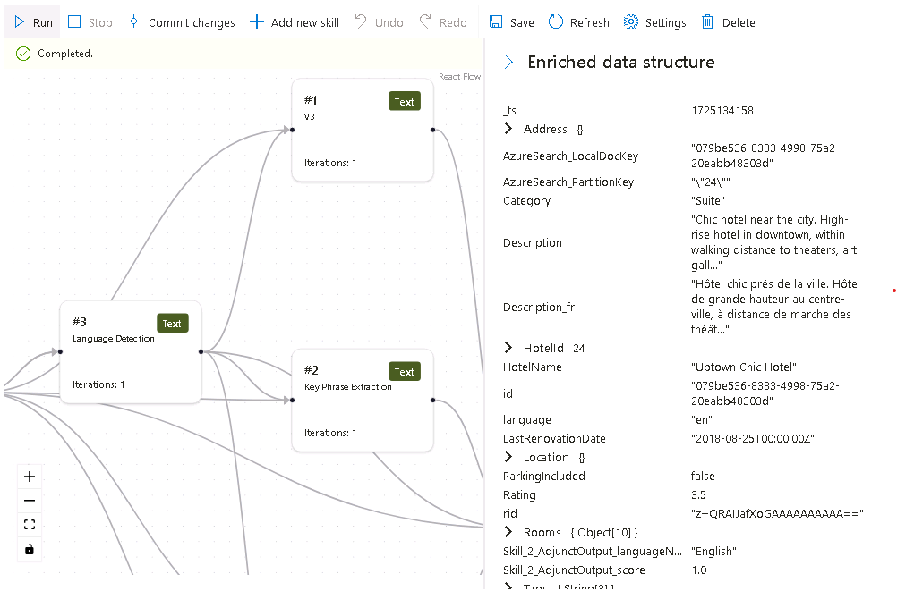

---
lab:
  title: Debuggen von Suchproblemen
---

# Debuggen von Suchproblemen

Sie haben Ihre Suchlösung erstellt, aber es gibt einige Warnungen im Indexer.

In dieser Übung erstellen Sie eine Azure KI-Suche-Lösung, importieren einige Beispieldaten, und beheben dann eine Warnung im Indexer.

> **Hinweis**: Um diese Übung abschließen zu können, benötigen Sie ein Microsoft Azure-Abonnement. Wenn Sie noch keines haben, können Sie sich unter [https://azure.com/free](https://azure.com/free?azure-portal=true) für eine kostenlose Testversion registrieren.

## Erstellen Ihrer Suchlösung

Bevor Sie mit einer Debugsitzung beginnen können, müssen Sie einen Azure AI-Suchdienst erstellen.

1. [Bereitstellen von Ressourcen in Azure](https://portal.azure.com/#create/Microsoft.Template/uri/https%3A%2F%2Fraw.githubusercontent.com%2FMicrosoftLearning%2Fmslearn-knowledge-mining%2Fmain%2FLabfiles%2F08-debug-search%2Fazuredeploy.json) - wenn Sie sich in einer gehosteten VM befinden, kopieren Sie diesen Link und fügen ihn in den VM-Browser ein. Andernfalls wählen Sie diesen Link, um alle benötigten Ressourcen im Azure-Portal bereitzustellen.

    

1. Wählen Sie unter **Ressourcengruppe** Ihre bereitgestellte Ressourcengruppe aus oder wählen Sie **Neu erstellen** und geben Sie **debug-search-exercise** ein.
1. Wählen Sie die Ihnen nächstgelegene **Region** oder verwenden Sie die Standardeinstellung.
1. Für **Ressourcenpräfix** geben Sie **debugsearch** ein und fügen eine zufällige Kombination von Zahlen oder Zeichen hinzu, um sicherzustellen, dass der Speichername eindeutig ist.
1. Wählen Sie für „Standort“ dieselbe Region aus, die Sie oben verwendet haben.
1. Klicken Sie im unteren Bereich auf **Überprüfen und erstellen**.
1. Warten Sie, bis die Ressource bereitgestellt wurde, und wählen Sie dann **Zu Ressourcengruppe wechseln** aus.

## Importieren von Beispieldaten und Konfigurieren von Ressourcen

Da Ihre Ressourcen erstellt wurden, können Sie jetzt Ihre Quelldaten importieren.

1. Navigieren Sie in den aufgelisteten Ressourcen zu dem Speicherkonto. Gehen Sie zu **Konfiguration** im linken Bereich, legen Sie **Anonymen Blob-Zugriff erlauben** auf **Aktiviert** fest und wählen Sie dann **Speichern**.
1. Navigieren Sie zurück zu Ihrer Ressourcengruppe und wählen Sie den Suchdienst aus.
1. Wählen Sie im Bereich **Übersicht** die Option **Daten importieren** aus.

      

1. Wählen Sie im Bereich „Daten importieren“ die Datenquelle **Samples** aus.

      

1. Wählen Sie **hotels-sample** aus der Liste der Beispiele aus.
1. Wählen Sie **Weiter: Kognitive Skills hinzufügen (optional)** aus.
1. Erweitern Sie den Abschnitt **Anreicherungen hinzufügen**.

    

1. Wählen Sie **Kognitive Fähigkeiten für Text** aus.
1. Wählen Sie **Weiter: Zielindex anpassen** aus.
1. Übernehmen Sie die Standardwerte, und wählen Sie **Weiter: Indexer erstellen** aus.
1. Klicken Sie auf **Submit** (Senden).

## Verwenden einer Debugsitzung zum Beheben von Warnungen in Ihrem Indexer

Der Indexer beginnt nun damit, 50 Dokumente zu erfassen. Wenn Sie jedoch den Status des Indexers überprüfen, sehen Sie, dass Warnungen vorhanden sind.

1. Wählen Sie **Debugsitzung** im linken Bereich aus.
1. Wählen Sie **+ Debugsitzung hinzufügen** aus.
1. Geben Sie einen Namen für die Sitzung an und wählen Sie **hotel-sample-indexer** für die **Indexer-Vorlage**.
1. Wählen Sie Ihr Speicherkonto aus dem Feld **Speicherkonto**. Dadurch wird automatisch ein Speichercontainer für Sie erstellt, der die Debug-Daten enthält.
1. Lassen Sie das Kontrollkästchen für die Authentifizierung mithilfe einer verwalteten Identität unmarkiert.
1. Wählen Sie **Speichern**.
1. Sobald die Debugsitzung erstellt ist, wird sie automatisch für die Daten in Ihrem Suchdienst ausgeführt. Sie sollte mit Fehlern/Warnungen abgeschlossen werden.

    Das Abhängigkeitsdiagramm zeigt Ihnen, dass für jedes Dokument ein Fehler zu drei Skills vorhanden ist.
    

    > **Hinweis**: Möglicherweise wird ein Fehler beim Herstellen einer Verbindung mit dem Speicherkonto und beim Konfigurieren von verwalteten Identitäten angezeigt. Dies passiert, wenn Sie versuchen, zu schnell zu debuggen, nachdem Sie den anonymen Blobzugriff aktiviert haben, und die Debugsitzung sollte weiterhin funktionieren. Wenn Sie das Browserfenster nach ein paar Minuten aktualisieren, sollte die Warnung verschwinden.

1. Wählen Sie im Abhängigkeitsdiagramm einen der Fähigkeitsknoten aus, die einen Fehler aufweisen.
1. Wählen Sie im Bereich „Skills details“ (Skilldetails) **Fehler/Warnungen (1)** aus.

    Die Details lauten:

    *Ungültiger Sprachcode '(Unbekannt)'. Unterstützte Sprachen: af,am,ar,as,az,bg,bn,bs,ca,cs,cy,da,de,el,en,es,et,eu,fa,fi,fr,ga,gl,gu,he,hi,hr,hu,hy,id,it,ja,ka,kk,km,kn,ko,ku,ky,lo,lt,lv, mg,mk,ml,mn,mr,ms,my,ne,nl,no,or,pa,pl,ps,pt-BR,pt-PT,ro,ru,sk,sl,so,sq,sr,ss,sv,sw,ta,te,th,tr,ug,uk,ur,uz,vi,zh-Hans,zh-Hant. Für weitere Details siehe https://aka.ms/language-service/language-support.*

    Wenn man sich das Abhängigkeitsdiagramm ansieht, hat die Fähigkeit „Spracherkennung“ Ausgaben für die drei Fähigkeiten mit Fehlern. Wenn Sie sich die Fähigkeiteneinstellungen mit Fehlern ansehen, werden Sie sehen, dass die Fähigkeitseingabe, die den Fehler verursacht, `languageCode` ist.

1. Wählen Sie im Abhängigkeitsdiagramm **Spracherkennung** aus.

    
    Beachten Sie in der JSON-Datei für Skilleinstellungen, dass `HotelId` als Feld für die Ableitung der Sprache verwendet wird.

    Dieses Feld verursacht den Fehler, da der Skill die Sprache nicht aus einer ID ableiten kann.

## Beheben der Warnung im Indexer

1. Wählen Sie unter „Eingaben“ die Option **Quelle** aus, und ändern Sie das Feld in `/document/Description`.
1. Wählen Sie **Speichern** aus.
1. Klicken Sie auf **Run** (Ausführen). Der Indexer sollte keine Fehler oder Warnungen mehr haben. Das Skillset kann jetzt aktualisiert werden.

    
   
1. Wählen Sie **Änderungen bestätigen**, um die in dieser Sitzung vorgenommenen Änderungen an Ihren Indexer zu übertragen.
1. Wählen Sie **OK** aus. Sie können ihre Sitzung jetzt löschen.

Jetzt müssen Sie sicherstellen, dass Ihr Skillset mit einer Azure KI- Dienstressource verbunden ist, da Sie sonst das Basiskontingent anfahren und der Indexer eine Zeitüberschreitung erleidet. 

1. Wählen Sie dazu im linken Bereich **Skillsets** aus, und wählen Sie dann Ihr **hotels-sample-skillset** aus.

    
1. Wählen Sie **KI-Dienst verbinden** aus, und wählen Sie dann die KI-Dienstressource in der Liste aus.

    
1. Wählen Sie **Speichern**.

1. Führen Sie nun Ihren Indexer aus, um die Dokumente mit den festen KI-Anreicherungen zu aktualisieren. Wählen Sie dazu im linken Bereich **Indexers** aus, wählen Sie **hotels-sample-indexer** und dann **Ausführen** aus.  Wenn die Ausführung abgeschlossen ist, sollten Sie sehen, dass die Warnungen jetzt null (0) sind.

    

## Bereinigung

 Nachdem Sie nun die Übung abgeschlossen und die Erkundung der Azure KI-Suche-Dienste beendet haben, löschen Sie die Azure-Ressourcen, die Sie während der Übung erstellt haben. Am einfachsten ist es, die Ressourcengruppe **debug-search-exercise** zu löschen.
